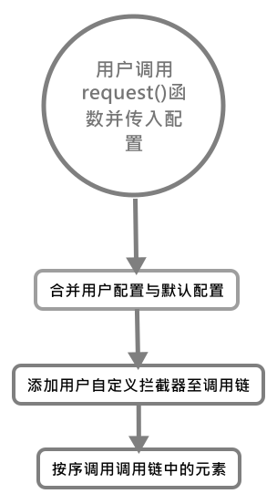

# Axios构造函数

其构造函数用于创建一个`Axios`实例，该实例具备一个拦截器和默认的配置。

```js
/**
 * Create a new instance of Axios
 *
 * @param {Object} instanceConfig The default config for the instance
 */
function Axios(instanceConfig) {

    // 设置实例的默认配置
    this.defaults = instanceConfig;

    // 为请求和响应对象设置拦截器
    this.interceptors = {
        request: new InterceptorManager(),
        response: new InterceptorManager()
    };
}
```

拦截器的作用是在请求发送前或响应后对请求进行提前的处理，在下面我们会介绍到。这里的`instanceConfig`最初来源于[跳转](./../默认配置)

## Axios.prototype.request——万恶起源，请求函数

所有的请求都是从该函数发起的，该函数被封装后，作为其他不同的方法来使用。

```js
/**
 * Dispatch a request
 *
 * @param {Object} config The config specific for this request (merged with this.defaults)
 */
Axios.prototype.request = function request(config) {

    // Allow for axios('example/url'[, config]) a la fetch API
    // 将参数处理为单个配置对象
    if (typeof config === 'string') {
        config = arguments[1] || {};
        config.url = arguments[0];
    } else {
        config = config || {};
    }

    // 合并配置，优先保留用户自定义配置(即config)
    config = mergeConfig(this.defaults, config);

    // 提取HTTP请求方法，默认为get
    config.method = config.method ? config.method.toLowerCase() : 'get';

    // Hook up interceptors middleware
    // 调度中间件，发送请求时，会按chain顺序调用里面的处理函数
    var chain = [dispatchRequest, undefined];
    var promise = Promise.resolve(config);

    // 调用所有的请求拦截器，将拦截器加入到发送请求前
    this.interceptors.request.forEach(function unshiftRequestInterceptors(interceptor) {
        chain.unshift(interceptor.fulfilled, interceptor.rejected);
    });

    // 调用所有的响应拦截器，将回调处理函数加入到返回响应之后
    this.interceptors.response.forEach(function pushResponseInterceptors(interceptor) {
        chain.push(interceptor.fulfilled, interceptor.rejected);
    });

    // 调用chain链
    while (chain.length) {
        promise = promise.then(chain.shift(), chain.shift());
    }

    // 返回最后的promise对象
    return promise;
};
```

从上面的函数我们可以知道，`request()`函数接收了用户配置后，开始处理参数问题，一般支持两种参数形式——**单纯的URL字符串**或**URL字符串+配置对象组合**；之后便是将用户使用的[拦截器](../../适配器)函数加入到调用链的前后，然后按需调用调用链。
___

而在调用链中最为关键的要属于[`dispatchRequest()`](../调度请求函数)函数，它才是真正的发送请求的函数，最后我们只需要等待响应结果即可了。



>通过上述代码，我们大约知道`Axios`实例大致的构成了：它由默认配置加上请求、响应拦截器对象组成。

## Axios上其他原型方法

接下来则是其原型上的方法，其实就只有一个`Axios.prototype.getUri()`，其余的方法都是通过装饰者模式的稍加修改后的暴露该接口至原型：

```js
// 接收一个配置对象，会修改默认配置，返回最终配置的URI字符串
Axios.prototype.getUri = function getUri(config) {

    // 修改默认配置(同名会覆盖原配置)
    config = mergeConfig(this.defaults, config);
    return buildURL(config.url, config.params, config.paramsSerializer).replace(/^\?/, '');
};

// Provide aliases for supported request methods
// 为请求方法提供别名
utils.forEach(['delete', 'get', 'head', 'options'], function forEachMethodNoData(method) {

    // 包装以上无请求主体方法至Axios原型对象(默认不提供请求主体的参数)
    Axios.prototype[method] = function (url, config) {
        return this.request(utils.merge(config || {}, {
            method: method,
            url: url
        }));
    };
});

// 包装有请求主体的方法，但参数的位置做有限制
utils.forEach(['post', 'put', 'patch'], function forEachMethodWithData(method) {
    /*eslint func-names:0*/
    Axios.prototype[method] = function (url, data, config) {
        return this.request(utils.merge(config || {}, {
            method: method,
            url: url,
            data: data
        }));
    };
});
```

我们可以看见基于`HTTP`方法封装的方法其实在参数位置上是有限制的，必须在**固定位置上填写参数**，且基于是否有报文主体，也进行了不同的配置(当然无主体的方法直接配置在用户自定义`config`上也可以携带主体)

[Axios构造函数源码](../axios/../../axios/lib/core/Axios.js)
